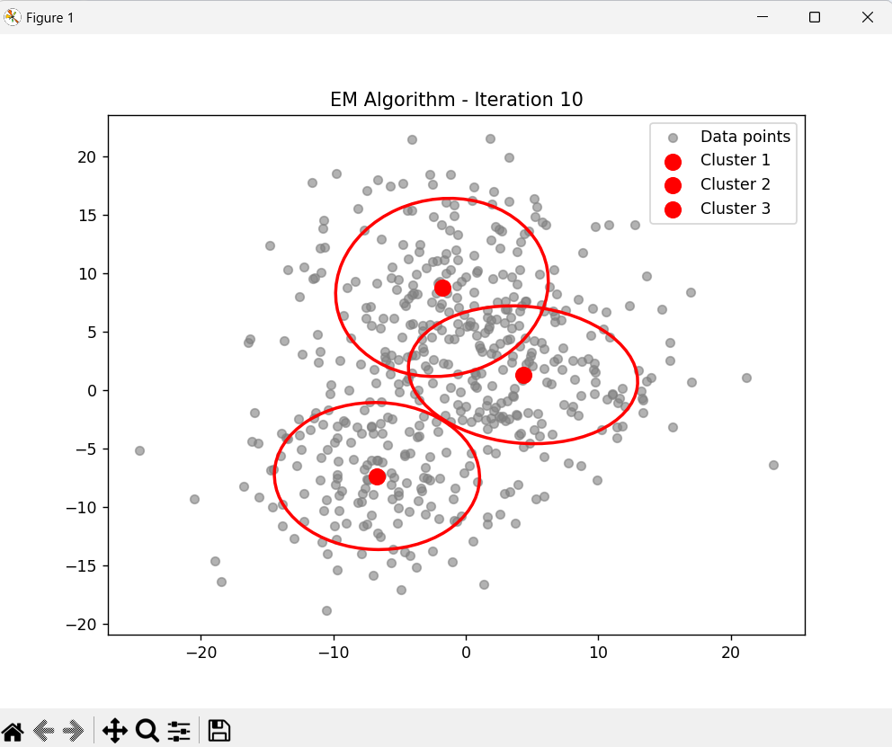

# EM-GMM-Image-Segmentation

This repository contains a Python implementation of the Expectation-Maximization (EM) algorithm applied to Gaussian Mixture Models (GMM) for image segmentation and clustering. The code demonstrates the clustering of 2D synthetic data points using the GMM, with real-time visualizations of the algorithm's iterations. This can be extended to image segmentation tasks where GMMs are used to model pixel intensity distributions.

## Features

- Gaussian Mixture Model (GMM) implementation using scikit-learn
- Real-time visualization of the EM algorithm's iterations
- Example of clustering synthetic 2D data with multiple Gaussian components
- Plotting of Gaussian components as ellipses representing the covariance structure
- Flexibility for adapting the code to image segmentation tasks

## Image Description

Here’s a screenshot of the animation showing the evolution of clusters during the EM algorithm. This image visualizes how the Gaussian Mixture Model is used to segment data points and the Gaussian components (ellipses) represent the clusters.



In this animation:
- The gray points represent the data points.
- The red ellipses represent the Gaussian components fitted to the data points.
- The GMM updates these components during each iteration of the Expectation-Maximization (EM) algorithm.


## Requirements

- Python 3.x
- numpy
- matplotlib
- scikit-learn
- scipy

## Installation

1. Clone the repository:
   ```bash
   git clone https://github.com/samehaisaa/EM-GMM-Image-Segmentation.git
   cd EM-GMM-Image-Segmentation
## Usage
2. Install dependencies
   ```bash
   pip install -r requirements.txt

## Usage

1. Run EM Visualization on Synthetic Data:
   ```bash
   python examples/run_em_visualization.py

   This script animates the iterative EM steps, showing Gaussian components adjusting to cluster the data.

2. Perform Image Segmentation
   ```bash
   python src/applications/image_segmentation.py --image data/images/sample_image.jpg
